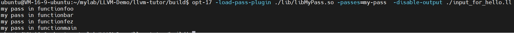
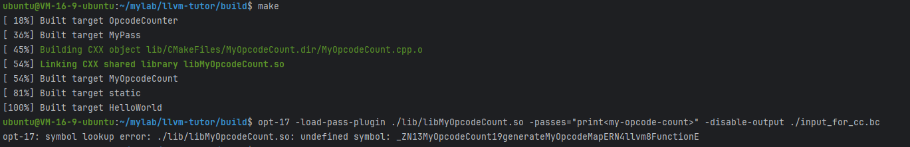
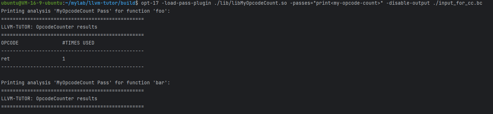
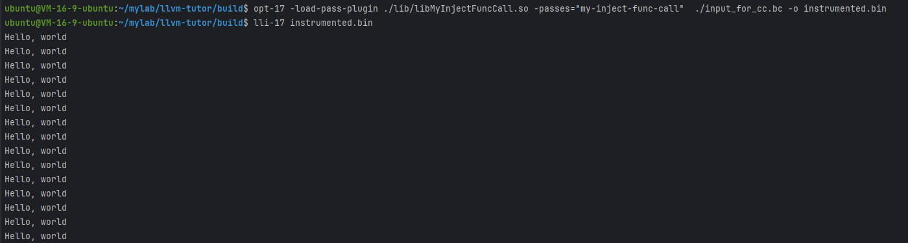
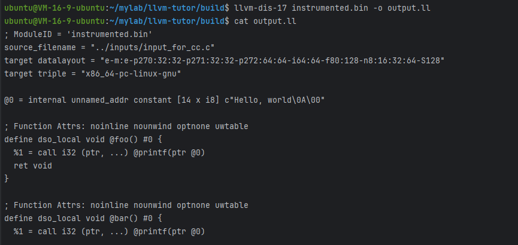
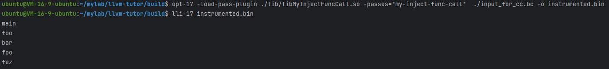
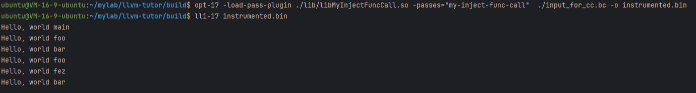
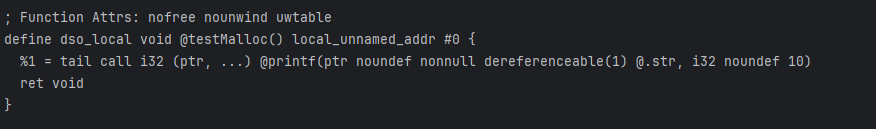

## LLVM环境安装

```
wget -O - https://apt.llvm.org/llvm-snapshot.gpg.key | sudo apt-key add -
sudo apt-add-repository "deb http://apt.llvm.org/jammy/ llvm-toolchain-jammy-17 main"
sudo apt-get update
sudo apt-get install -y llvm-17 llvm-17-dev llvm-17-tools clang-17
```

## 运行Demo

```
export LLVM_DIR=<installation/dir/of/llvm/17>
mkdir build
cd build
cmake -DLT_LLVM_INSTALL_DIR=$LLVM_DIR <source/dir/llvm/tutor>/HelloWorld/
make
```

这里我们是直接用apt-get install安装的，默认路径是/usr/lib/llvm-17
设置：` export LLVM_DIR=/usr/lib/llvm-17`
执行：
```
cmake -DLT_LLVM_INSTALL_DIR=$LLVM_DIR ../HelloWorld/
make 
clang-17 -O1 -S -emit-llvm /home/ubuntu/mylab/llvm-tutor/inputs/input_for_hello.c -o input_for_hello.ll
opt-17 -load-pass-plugin ./libHelloWorld.so -passes=hello-world -disable-output input_for_hello.ll
```

注意 ：

new pass manager with opt:
```
opt-17 -load-pass-plugin ./libHelloWorld.so -passes=hello-world -disable-output input_for_hello.ll
```

legacy pass manager with opt:
```angular2html
opt-17 -load-pass-plugin ./libHelloWorld.so -passes=hello-world -disable-output input_for_hello.ll

```

## MyPass
前面都是直接抄来的，这里自己参考写一下，虽然也没什么，就当练练手：
```shell
ubuntu@VM-16-9-ubuntu:~/mylab/LLVM-Demo/llvm-tutor/build$ clang-17 -O1 -S -emit-llvm /home/ubuntu/mylab/LLVM-Demo/llvm-tutor/inputs/input_for_hello.c -o input_for_hello.ll
ubuntu@VM-16-9-ubuntu:~/mylab/LLVM-Demo/llvm-tutor/build$ opt-17 -load-pass-plugin ./lib/libMyPass.so -passes=my-pass  -disable-output ./input_for_hello.ll
```


## OpcodeCounter
OpcodeCounter 类是一个 FunctionAnalysis，它负责实际对函数进行分析并生成相应的结果。在 LLVM 中，FunctionAnalysis OpcodeCounter 类实现了对函数中所有指令的操作码进行提取，并返回对应的字符串结果。

OpcodeCounterPrinter 类是一个 Pass，它将 MyAnalysis 包装成一个可被 LLVM 工具链调用的 pass。Pass 是 LLVM 中用于表示各种转换、分析和优化的基本单元，可以在 LLVM 的优化流水线中组合使用。OpcodeCounterPrinter 类中的 run 函数负责打印分析结果，并返回表示分析没有修改 LLVM IR 代码的标记。

因此，两个类的设计是符合 LLVM 框架中分析和优化的一般模式的：一个类负责实际的分析过程，另一个类负责将该分析包装成一个可被 LLVM 工具链调用的 pass。这样的设计使得分析部分和 pass 部分的职责清晰，易于维护和组合使用。


## OpcodeCounter
我自己写了一个MyOpcodeCount 其实是完全模仿OpcodeCounter, 但是是清空之后 基本从头构建的。
虽然是完全模仿，但是在做的过程中还是遇到不少问题。主要是由于自己的C++基础比较弱。
这里也提一下，给自己一个记录。

主要问题在于，在头文件中定义了：
OpcodeCounter::Result generateOpcodeMap(llvm::Function &F);

然后我在cpp文件中就直接复制过去实现了，
```C++
MyOpcodeCount::Result generateMyOpcodeMap(llvm::Function &F){
//my code
}
```
导致报错：

可以看到，编译没有问题，运行出现问题了。（这种情况我很久以前就遇到过，所以这里着重记录一下）

问题的关键是 这个是属于类中的方法； 在cpp代码中的实现应该是：
```C++
MyOpcodeCount::Result MyOpcodeCount::generateMyOpcodeMap(llvm::Function &F){
//my code
}
```

调整后运行：


## 插桩，从hello world开始

关键代码如下：
```c++
bool MyInjectFuncCall::runOnModule(Module &M) {
  auto &ctx = M.getContext();
    //创建字符串常量
    llvm::Constant *strConstant = llvm::ConstantDataArray::getString(ctx, "Hello, world\n");
    llvm::GlobalVariable *strVar = new llvm::GlobalVariable(M, strConstant->getType(), true, llvm::GlobalValue::InternalLinkage, strConstant);
    strVar->setUnnamedAddr(llvm::GlobalValue::UnnamedAddr::Global);

    // 获取 printf 函数的声明
    llvm::FunctionType *printfType = llvm::FunctionType::get(llvm::IntegerType::getInt32Ty(ctx), llvm::PointerType::get(llvm::Type::getInt8Ty(ctx), 0), true);
    llvm::FunctionCallee printfFunc = M.getOrInsertFunction("printf", printfType);

    // 在每个函数的开头插入 printf 调用指令
    for (llvm::Module::iterator funcIter = M.begin(), funcEnd = M.end(); funcIter != funcEnd; ++funcIter) {
        llvm::Function &F = *funcIter;
        if (F.isDeclaration())
            continue;
        llvm::BasicBlock &entryBlock = F.getEntryBlock();
        llvm::Instruction &firstInstruction = *(entryBlock.getFirstInsertionPt());
        llvm::IRBuilder<> builder(&firstInstruction);
        llvm::Value *args[] = {builder.CreateBitCast(strVar, llvm::Type::getInt8PtrTy(ctx))};
        builder.CreateCall(printfFunc, args);
    }

  return true;
}
```
###  llvm::FunctionType::get的参数


### 函数类型的定义
为什么要有：llvm::FunctionType::get(llvm::IntegerType::getInt32Ty(ctx), llvm::PointerType::get(llvm::Type::getInt8Ty(ctx), 0), true);
llvm::FunctionType::get 是 LLVM 中用于创建函数类型的静态方法，它接受以下参数：

returnType：表示函数的返回类型。这个参数指定了函数返回值的类型，可以是整数、浮点数、指针等类型。

paramTypes：表示函数的参数类型列表。这是一个数组，用于指定函数的各个参数的类型。每个元素都表示一个参数的类型，可以是整数、浮点数、指针等类型。

isVarArg：一个布尔值，表示函数是否支持可变参数。如果设为 true，则表示函数支持可变参数；如果设为 false，则表示函数不支持可变参数。

综合起来，llvm::FunctionType::get 方法的作用是创建一个**函数类型对象**，其中包括函数的返回类型、参数类型列表以及是否支持可变参数。这个函数类型对象可以用于声明函数或者获取函数指针，以便在 LLVM IR 中进行函数调用。

### 函数的声明
llvm::FunctionCallee printfFunc = M.getOrInsertFunction("printf", printfType); 
这行代码是在 LLVM IR 中声明一个函数，并返回对该函数的引用

**为什么不直接用llvm::FunctionCallee printfFunc = M.getOrInsertFunction("printf", printfType); 而是先llvm::FunctionType::get(llvm::IntegerType::getInt32Ty(ctx), llvm::PointerType::get(llvm::Type::getInt8Ty(ctx), 0), true);**
在 LLVM 中，首先需要定义函数的类型（FunctionType），然后才能使用这个类型来声明或者获取函数。这是因为在 LLVM 中，函数的类型和函数本身是分开定义的。

所以在这段代码中，先使用 llvm::FunctionType::get() 方法创建了一个名为 printfType 的函数类型对象，表示 printf 函数的类型。然后再使用这个类型来声明或获取函数，即 llvm::FunctionCallee printfFunc = M.getOrInsertFunction("printf", printfType);。

这样做的好处是可以明确地定义函数的类型，并且在整个 LLVM IR 中可以复用这个类型。此外，如果有多个函数需要使用相同的类型，也可以避免重复定义，提高了代码的可维护性和可读性。


查看一下ir文件


## 创建局部变量并打印函数名
```c++
StringRef fname = F.getName().str()+"\n";
llvm::Type* localType = llvm::ArrayType::get(llvm::IntegerType::get(ctx, 8), fname.size() + 1);
llvm::AllocaInst* local_Var = builder.CreateAlloca(localType, nullptr, "funcName");

llvm::Constant* localConstant = llvm::ConstantDataArray::getString(ctx, fname, true);
builder.CreateStore(localConstant, local_Var);

llvm::Value *args[] = {builder.CreateBitCast(local_Var, llvm::Type::getInt8PtrTy(ctx))
};
builder.CreateCall(printfFunc, args);
```



对比一下创建全局变量的：
```c++
    llvm::Constant *strConstant = llvm::ConstantDataArray::getString(ctx, "Hello, world\n");
    llvm::GlobalVariable *strVar = new llvm::GlobalVariable(M, strConstant->getType(), true, llvm::GlobalValue::InternalLinkage, strConstant);
    strVar->setUnnamedAddr(llvm::GlobalValue::UnnamedAddr::Global);
```
差异还是挺大的。

## 尝试打印hello world和函数名
我尝试构造
printf("Hello world\n", funcName);
但是C++ 是不能这么处理的
print("Hello world %s", funcName);
所以第一个参数应该"Hello world %s"
第二个参数应该是funcName
这里第一个参数直接写为：
``` 
llvm::Constant *strConstant = llvm::ConstantDataArray::getString(ctx, "Hello, world %s\n");
llvm::GlobalVariable *strVar = new llvm::GlobalVariable(M, strConstant->getType(), true, llvm::GlobalValue::InternalLinkage, strConstant);
strVar->setUnnamedAddr(llvm::GlobalValue::UnnamedAddr::Global);
```




## 统计alloc分配次数
这里我创建了一个MemCaculate类，用来统计alloc分配次数，关键代码如下：
```c++
    int malloc_count =0;
    int calloc_count = 0;
    int realloc_count = 0;

    std::cout <<"===================="<< Func.getName().str()<<"====================="<<std::endl;
    for (auto &BB : Func) {
        for (auto &Inst : BB) {
            if (CallInst* CI = dyn_cast<CallInst>(&Inst)) {
                Function* calledFunction = CI->getCalledFunction();
                std::cout << calledFunction->getName().str()<<"\n";
                if (calledFunction && calledFunction->getName() == "malloc") {
                    malloc_count++;
                }
                if (calledFunction && calledFunction->getName() == "calloc") {
                    calloc_count++;
                }
                if (calledFunction && calledFunction->getName() == "realloc") {
                    realloc_count++;
                }
            }
        }
    }
    std::cout <<  "malloc_count: ";
    std::cout << malloc_count<<std::endl;
    std::cout << "calloc_count: ";
    std::cout << calloc_count<<std::endl;
    std::cout << "realloc_count: ";
    std::cout << realloc_count<<std::endl;
```

然后写了一个测试用例：
```c++
//
// Created by ftang on 2023/11/23.
//
#include <stdio.h>
#include <stdlib.h>

void testMalloc() {
    int* ptr = (int*)malloc(sizeof(int));
    if (ptr != NULL) {
        *ptr = 10;
        printf("Malloc: %d\n", *ptr);
        free(ptr);
    }
}

void testCalloc() {
    int* ptr = (int*)calloc(5, sizeof(int));
    if (ptr != NULL) {
        for (int i = 0; i < 5; i++) {
            ptr[i] = i;
        }
        printf("Calloc: ");
        for (int i = 0; i < 5; i++) {
            printf("%d ", ptr[i]);
        }
        printf("\n");
        free(ptr);
    }
}

void testRealloc() {
    int* ptr = (int*)malloc(5 * sizeof(int));
    if (ptr != NULL) {
        printf("Realloc (Before): ");
        for (int i = 0; i < 5; i++) {
            ptr[i] = i;
            printf("%d ", ptr[i]);
        }
        printf("\n");

        ptr = (int*)realloc(ptr, 10 * sizeof(int));
        if (ptr != NULL) {
            printf("Realloc (After): ");
            for (int i = 0; i < 10; i++) {
                ptr[i] = i;
                printf("%d ", ptr[i]);
            }
            printf("\n");
            free(ptr);
        }
    }
}

```
然而，运行发现，实际统计的跟预期不符合，比如testMalloc里面没有malloc？

查看ll文件，发现确实是没有的


这时想到，应该是优化了，回头看生成ll文件时果然用了O1,改为O0后结果如下：
```shell
ubuntu@VM-16-9-ubuntu:~/mylab/llvm-tutor/build$ clang-17 -O0 -S -emit-llvm /home/ubuntu/mylab/llvm-tutor/inputs/input_for_mem_caculate.c -o input_for_mem_caculate.ll
ubuntu@VM-16-9-ubuntu:~/mylab/llvm-tutor/build$ opt-17 -load-pass-plugin ./lib/libMemCaculate.so -passes="mem-caculate" -disable-output ./input_for_mem_caculate.ll 
====================testMalloc=====================
malloc
printf
free
malloc_count: 1
calloc_count: 0
realloc_count: 0
====================testCalloc=====================
calloc
printf
printf
printf
free
malloc_count: 0
calloc_count: 1
realloc_count: 0
====================testRealloc=====================
malloc
printf
printf
printf
realloc
printf
printf
printf
free
malloc_count: 1
calloc_count: 0
realloc_count: 1

```

## 统计函数调用
llvm-tutor中介绍了两种方法，第一种是静态分析，也就是前一部分我们用到的，在（直接）调用函数的时候进行统计；另一种是动态分析，是在被调用函数内部进行统计，每调用一次，就进行一次统计。
大致是这个思路，以后有时间再看。